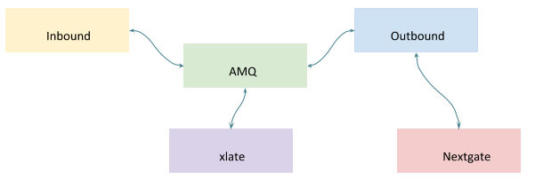
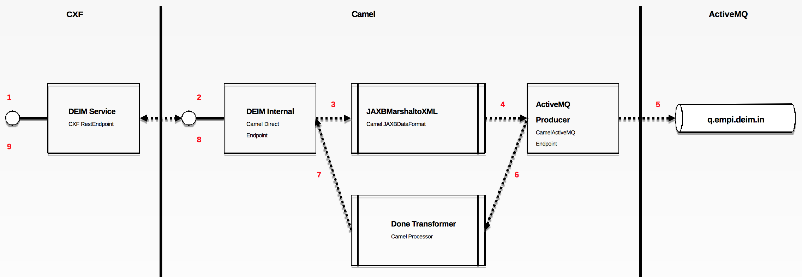
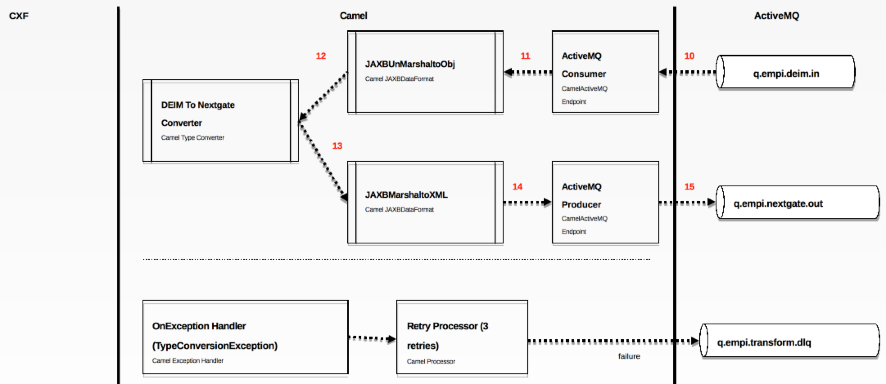
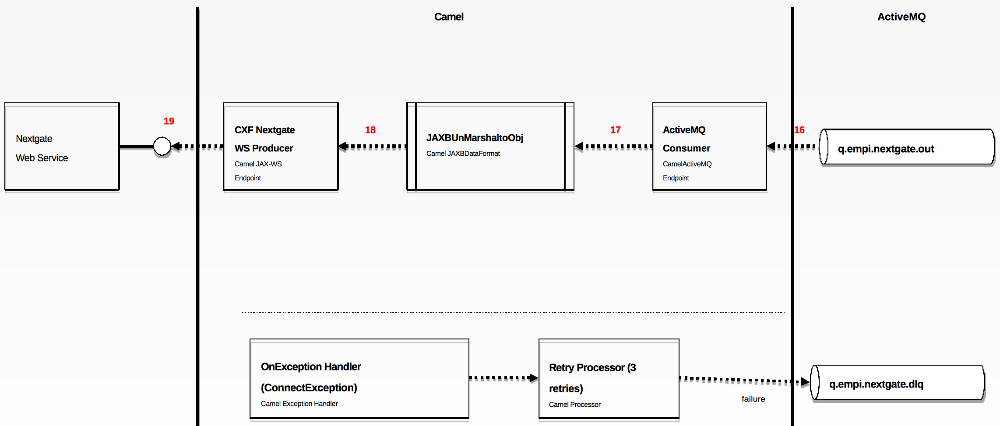
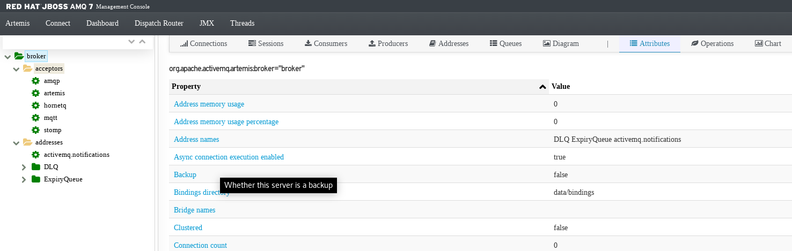
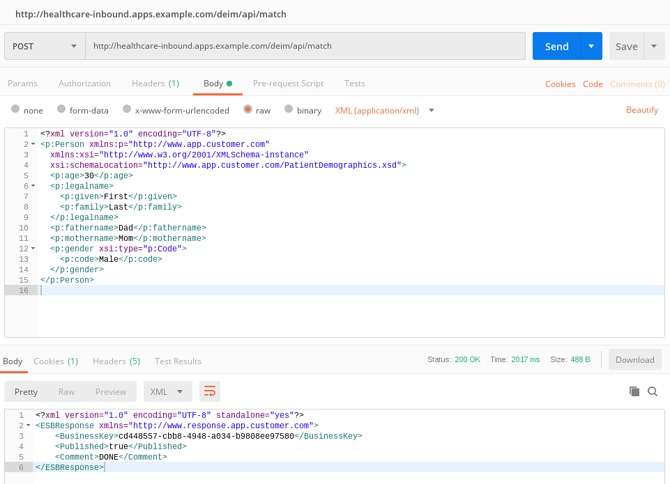

= What's Healthcare?
:toc: manual

Healthcare System is mainly for synchronization of master patient records across different healthcare providers. It is important to have consistent patient information across these multiple providers so that patients may receive consistent care. For that to occur, their personal and medical information needs to be shared. Also, any updates to the patient record need to flow across the providers to maintain accuracy and currency.

Primary purpose of this documents is provide a way to deploy Healthcare System both locally and on cloud OpenShift.

== Healthcare System Introduction

Healthcare System is a Fuse(Camel)/AMQ/Apache CXF based project, which mainly contains 3 components:

* *Inbound* - Receive the inbound request via a DEIM Rest Service entrypoint, each request will trigger a camel content, which marshal the request object to xml, then send xml to Queue.
* *Xlate* - Provide a type convert function, which convert the `DEIM REST Service` model to `Nextgate SOAP Service` model, the converted result be sent to Queue
* *Outbound* - Retrive the `Nextgate SOAP Service` model from Queue, invoke the `Nextgate` Service.

=== Inbound Route

1. DEIM REST Service receive the request 
2. DEIM REST Service invoke the Camel Route, forward request to Camel Route
3. JAXB Marshal request Object to XML Format
4. Initialize AMQ Client(AMQP Configuration, JmsConnectionFactory, Producer, etc)
5. Send the XML format request to Queue
6. Format response code base on Queue Sender results
7. Send the response code back to DEIM REST Service
8. DEIM REST Service Recieve Camel route response code
9. Done 

=== Xlate Route

10. Consume message from Queue
11. Trigger the JAXB, unmarshal XML to Object
12. Invoke Type Convert Processor, convert the `DEIM REST Service` model to `Nextgate SOAP Service` model
13. JAXB marshal converted result to xml
14. Trigger AMQ Client(AMQP Configuration, JmsConnectionFactory, Producer, etc)
15. Send converted result to Queue

=== Outbound Route

16. Consume message from Queue
17. Trigger the JAXB, unmarshal XML to Object
18. Invoke Nextgate Web Service 
19. Send Request to Nextgate Web Service

=== Full Modules

The completed modules including:

[cols="2,5a"]
|===
|*Module Name* |*DESC/NOTES*

|model
|Healthcare XSD Schema based model.

|nextgate-model
|Nextgate SOAP Service XSD Schema based model.

|inbound
|Handle the request, forward the result to Queue, refer to <<Inbound Route, Inbound Route>> for more details.

|xlate
|Type convert module, forward the converted result to Queue, refer to <<Xlate Route, Xlate Route>> for more details.

|outbound
|Invoke Nextgate SOAP Service, refer to <<Outbound Route, Outbound Route>> for more details.

|nextgate
|A simple NextGate SOAP Web Service，which used to keep Patient Records.

|client
|Used for test, a simple JMS Client which used to message to `q.empi.deim.in`, the message is a text message is Marshalled from a `com.customer.app.Person` Object with JAXB.
|===

=== Build

[source, java]
----
$ git clone https://github.com/kylinsoong/healthcare.git
$ cd healthcare/
$ mvn clean package
...
[INFO] healthcare ......................................... SUCCESS [  0.162 s]
[INFO] Healthcare Model ................................... SUCCESS [  3.633 s]
[INFO] Healthcare Nextgate Model .......................... SUCCESS [  0.176 s]
[INFO] Healthcare NextGate SOAP Service ................... SUCCESS [  1.099 s]
[INFO] Healthcare Inbound ................................. SUCCESS [  5.044 s]
[INFO] Healthcare xlate ................................... SUCCESS [  0.757 s]
[INFO] Healthcare outbound ................................ SUCCESS [  0.679 s]
[INFO] Healthcare Client .................................. SUCCESS [  0.115 s]
[INFO] ------------------------------------------------------------------------
[INFO] BUILD SUCCESS
[INFO] ------------------------------------------------------------------------
...
----

== Healthcare System Deployment

=== Prerequisites

[source, text]
.*1. Create Imagestream fuse7-java-openshift in OpenShift(link:etc/files/fuse7-java-openshift.json[fuse7-java-openshift.json])*
----
# oc create -f fuse7-java-openshift.json -n openshift
----

[source, text]
.*2. Deploy Nextgate SOAP Service*
----
$ cd nextgate
$ mvn fabric8:deploy -Popenshift
----

Refer to link:nextgate/README.adoc[nextgate/README.adoc] for more details.

=== AMQ

==== Local Deployment

[source, text]
.*1. unzip to install*
----
$ unzip amq-broker-7.2.3-bin.zip && cd amq-broker-7.2.3
----

[source, text]
.*2. Create a broker*
----
$ ./bin/artemis create --user admin --password admin --role admin --allow-anonymous y ./instances/broker1
----

[source, text]
.*3. Start the broker*
----
$ cd instances/broker1/
$ ./bin/artemis run
----

*4. Login to AMQ Console*

Access the http://localhost:8161/console in a broswer, login with `admin`/`admin`.

==== Deploy to OpenShift

[source, text]
.*1. Download Imagestream templete*
----
# wget https://raw.githubusercontent.com/jboss-container-images/jboss-amq-7-broker-openshift-image/amq-broker-72/amq-broker-7-image-streams.yaml
----

[source, text]
.*2. Edit Imagestream, change registry.access.redhat.com to registry.example.com*
----
# vim amq-broker-7-image-streams.yaml
...
registry.example.com/amq-broker-7/amq-broker-72-openshift:1.1
registry.example.com/amq-broker-7/amq-broker-72-openshift:1.0
----

[source, text]
.*3. Create Imagestream*
----
# oc replace --force  -f amq-broker-7-image-streams.yaml -n openshift
----

[source, text]
.*4. Create AMQ Broker via link:etc/files/amq-broker-72-basic.yaml[amq-broker-72-basic.yaml]*
----
# oc create -f amq-broker-72-basic.yaml
# oc policy add-role-to-user view system:serviceaccount:healthcare:amq-service-account
# oc new-app --template=amq-broker-72-basic -e AMQ_PROTOCOL=openwire,amqp,stomp,mqtt,hornetq -e AMQ_USER=admin -e AMQ_PASSWORD=admin -e AMQ_ROLE=admin
----

[source, text]
.*5. Check that the broker pod is running*
----
# oc get pods
NAME                 READY     STATUS    RESTARTS   AGE
broker-amq-1-8gsv7   1/1       Running   0          1m
----

*6. Login to AMQ Console*

Access the http://amq-console-healthcare.apps.example.com/console in a broswer, login with `admin`/`admin`.

=== Inbound

[source, bash]
----
$ oc login https://master.example.com:8443 -u admin -p admin
$ oc project healthcare
$ cd inbound/
$ mvn fabric8:deploy -Popenshift
----

=== Xlate

[source, bash]
----
$ oc login https://master.example.com:8443 -u admin -p admin
$ oc project healthcare
$ cd xlate/
$ mvn fabric8:deploy -Popenshift
----

=== Outbound

[source, bash]
----
$ oc login https://master.example.com:8443 -u admin -p admin
$ oc project healthcare
$ cd outbound/
$ mvn fabric8:deploy -Popenshift
----

== Healthcare System Demonstration

=== Deployment Overview

If deploy all Healthcare System related modules and prerequisites to OpenShift, you should find the following pods, services and routes:

[source, bash]
.*1. Pods*
----
$ oc get pods | grep Running
broker-amq-1-f9n9c                1/1       Running     0          <invalid>
healthcare-inbound-1-52twc        1/1       Running     0          <invalid>
healthcare-nextgate-1-jjx7f       1/1       Running     0          <invalid>
healthcare-outbound-1-9cqnl       1/1       Running     0          <invalid>
healthcare-xlate-1-sf5kw          1/1       Running     0          <invalid>
----

[source, bash]
.*2. Services*
----
$ oc get services
NAME                  TYPE        CLUSTER-IP       EXTERNAL-IP   PORT(S)     AGE
broker-amq-amqp       ClusterIP   172.30.209.70    <none>        5672/TCP    <invalid>
broker-amq-jolokia    ClusterIP   172.30.98.43     <none>        8161/TCP    <invalid>
broker-amq-mqtt       ClusterIP   172.30.71.221    <none>        1883/TCP    <invalid>
broker-amq-stomp      ClusterIP   172.30.135.44    <none>        61613/TCP   <invalid>
broker-amq-tcp        ClusterIP   172.30.118.101   <none>        61616/TCP   <invalid>
healthcare-inbound    ClusterIP   172.30.130.107   <none>        8080/TCP    <invalid>
healthcare-nextgate   ClusterIP   172.30.41.159    <none>        8080/TCP    <invalid>
healthcare-outbound   ClusterIP   172.30.148.254   <none>        8080/TCP    <invalid>
healthcare-xlate      ClusterIP   172.30.73.243    <none>        8080/TCP    <invalid>
----

[source, bash]
.*3. Routes*
----
$ oc get routes
NAME                  HOST/PORT                                 PATH      SERVICES              PORT      TERMINATION   WILDCARD
amq-console           amq-console-healthcare.apps.example.com             broker-amq-jolokia    <all>                   None
healthcare-inbound    healthcare-inbound.apps.example.com                 healthcare-inbound    8080                    None
healthcare-nextgate   healthcare-nextgate.apps.example.com                healthcare-nextgate   8080                    None
----

=== Scenario Test

Use the Post test tools like Post man, send a Post request with:

* URL - http://healthcare-inbound.apps.example.com/deim/api/match
* Body Content:

[source, xml]
----
<?xml version="1.0" encoding="UTF-8"?>
<p:Person xmlns:p="http://www.app.customer.com"
  xmlns:xsi="http://www.w3.org/2001/XMLSchema-instance"
  xsi:schemaLocation="http://www.app.customer.com/PatientDemographics.xsd">
  <p:age>30</p:age>
  <p:legalname>
    <p:given>First</p:given>
    <p:family>Last</p:family>
  </p:legalname>
  <p:fathername>Dad</p:fathername>
  <p:mothername>Mom</p:mothername>
  <p:gender xsi:type="p:Code">
    <p:code>Male</p:code>
  </p:gender>
</p:Person>
----

The responses should be like

[source, xml]
----
<?xml version="1.0" encoding="UTF-8" standalone="yes"?>
<ESBResponse xmlns="http://www.response.app.customer.com">
    <BusinessKey>cd448557-cbb8-4948-a034-b9808ee97580</BusinessKey>
    <Published>true</Published>
    <Comment>DONE</Comment>
</ESBResponse>
----
 

In a complete scenario test, the inbout, xlate, outbout logs as folowing:

[source, text]
.*1. healthcare-inbound*
----
18:14:59.072 [XNIO-3 task-1] INFO  com.healthcare.DEIMService - Receive Request: com.customer.app.Person@3be20ac1
18:14:59.072 [XNIO-3 task-1] INFO  com.healthcare.DEIMService -     age: 30
18:14:59.072 [XNIO-3 task-1] INFO  com.healthcare.DEIMService -         givenrname: First
18:14:59.072 [XNIO-3 task-1] INFO  com.healthcare.DEIMService -         familyname: Last
18:14:59.072 [XNIO-3 task-1] INFO  com.healthcare.DEIMService -     fathername: Dad
18:14:59.072 [XNIO-3 task-1] INFO  com.healthcare.DEIMService -     mothername: Mom
18:14:59.072 [XNIO-3 task-1] INFO  com.healthcare.DEIMService -         gender: Male
18:14:59.072 [XNIO-3 task-1] INFO  com.healthcare.DEIMService - 
18:14:59.073 [XNIO-3 task-1] INFO  matchRoute - Receive DEIM Service's Request: <?xml version="1.0" encoding="UTF-8" standalone="yes"?>
<Person xmlns="http://www.app.customer.com">
    <age>30</age>
    <legalname>
        <given>First</given>
        <family>Last</family>
    </legalname>
    <fathername>Dad</fathername>
    <mothername>Mom</mothername>
    <gender>
        <code>Male</code>
    </gender>
</Person>

18:14:59.092 [AmqpProvider :(5):[amqp://broker-amq-amqp:5672]] INFO  o.a.q.jms.sasl.SaslMechanismFinder - Best match for SASL auth was: SASL-PLAIN
18:14:59.109 [AmqpProvider :(5):[amqp://broker-amq-amqp:5672]] INFO  org.apache.qpid.jms.JmsConnection - Connection ID:eba377a8-482e-47eb-bf75-a49634b90373:5 connected to remote Broker: amqp://broker-amq-amqp:5672
18:14:59.130 [XNIO-3 task-1] INFO  matchRoute - Send to DEIM Queue
----

[source, text]
.*2. healthcare-xlate*
----
18:14:51.917 [Camel (MyCamel) thread #1 - JmsConsumer[q.empi.deim.in]] INFO  xlateRoute - Receive Message From Queue: <?xml version="1.0" encoding="UTF-8" standalone="yes"?>
<Person xmlns="http://www.app.customer.com">
    <age>30</age>
    <legalname>
        <given>First</given>
        <family>Last</family>
    </legalname>
    <fathername>Dad</fathername>
    <mothername>Mom</mothername>
    <gender>
        <code>Male</code>
    </gender>
</Person>

18:14:51.919 [Camel (MyCamel) thread #1 - JmsConsumer[q.empi.deim.in]] INFO  xlateRoute - After Unmarshal: <?xml version="1.0" encoding="UTF-8" standalone="yes"?>
<Person xmlns="http://www.app.customer.com">
    <age>30</age>
    <legalname>
        <given>First</given>
        <family>Last</family>
    </legalname>
    <fathername>Dad</fathername>
    <mothername>Mom</mothername>
    <gender>
        <code>Male</code>
    </gender>
</Person>

18:14:51.959 [Camel (MyCamel) thread #1 - JmsConsumer[q.empi.deim.in]] INFO  xlateRoute - Before Convert: com.customer.app.Person
18:14:51.960 [Camel (MyCamel) thread #1 - JmsConsumer[q.empi.deim.in]] INFO  xlateRoute - After  Convert: com.nextgate.model.GetExecuteMatchUpdateRequest
18:14:51.961 [Camel (MyCamel) thread #1 - JmsConsumer[q.empi.deim.in]] INFO  xlateRoute - After  Marshal: <?xml version="1.0" encoding="UTF-8" standalone="yes"?>
<getExecuteMatchUpdateRequest xmlns="http://nextgate.com/nextgate-service">
    <ExecuteMatchUpdate>
        <age>30</age>
        <givenName>First</givenName>
        <familyName>Last</familyName>
        <fatherName>Dad</fatherName>
        <motherName>Mom</motherName>
        <gender>M</gender>
    </ExecuteMatchUpdate>
</getExecuteMatchUpdateRequest>

18:14:51.972 [Camel (MyCamel) thread #1 - JmsConsumer[q.empi.deim.in]] INFO  xlateRoute - Send to nextGate Queue
----

[source, text]
.*3. healthcare-outbound*
----
18:14:59.257 [Camel (MyCamel) thread #1 - JmsConsumer[q.empi.nextgate.out]] INFO  xlateRoute - Receive Message From Queue: <?xml version="1.0" encoding="UTF-8" standalone="yes"?>
<getExecuteMatchUpdateRequest xmlns="http://nextgate.com/nextgate-service">
    <ExecuteMatchUpdate>
        <age>30</age>
        <givenName>First</givenName>
        <familyName>Last</familyName>
        <fatherName>Dad</fatherName>
        <motherName>Mom</motherName>
        <gender>M</gender>
    </ExecuteMatchUpdate>
</getExecuteMatchUpdateRequest>

18:14:59.417 [Camel (MyCamel) thread #1 - JmsConsumer[q.empi.nextgate.out]] INFO  xlateRoute - Before Unmarshal: [B
18:14:59.429 [Camel (MyCamel) thread #1 - JmsConsumer[q.empi.nextgate.out]] INFO  xlateRoute - After Unmarshal: com.nextgate.model.GetExecuteMatchUpdateRequest
18:14:59.452 [Camel (MyCamel) thread #1 - JmsConsumer[q.empi.nextgate.out]] INFO  xlateRoute - SOAP Request: <?xml version="1.0" encoding="UTF-8" standalone="yes"?>
<ns2:Envelope xmlns:ns2="http://schemas.xmlsoap.org/soap/envelope/" xmlns:ns3="http://nextgate.com/nextgate-service">
    <ns2:Body>
        <ns3:getExecuteMatchUpdateRequest>
            <ns3:ExecuteMatchUpdate>
                <ns3:age>30</ns3:age>
                <ns3:givenName>First</ns3:givenName>
                <ns3:familyName>Last</ns3:familyName>
                <ns3:fatherName>Dad</ns3:fatherName>
                <ns3:motherName>Mom</ns3:motherName>
                <ns3:gender>M</ns3:gender>
            </ns3:ExecuteMatchUpdate>
        </ns3:getExecuteMatchUpdateRequest>
    </ns2:Body>
</ns2:Envelope>

18:14:59.452 [Camel (MyCamel) thread #1 - JmsConsumer[q.empi.nextgate.out]] INFO  xlateRoute - Invoke NextGate Service
----
